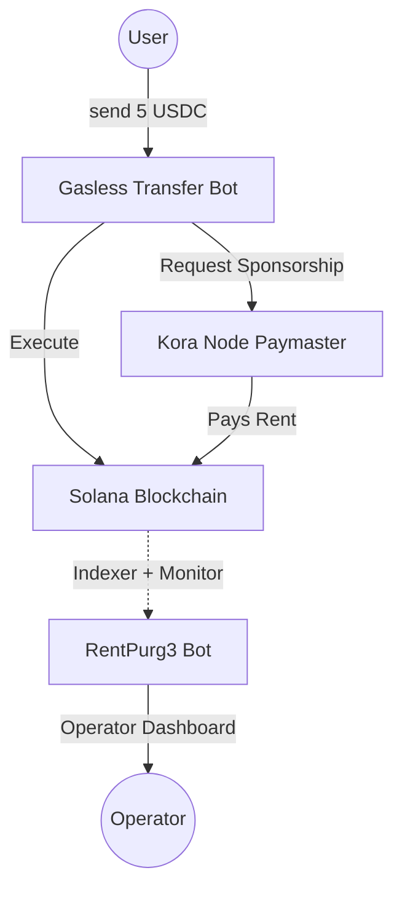

# RentPurg3 – Automated Rent Reclaim System for Kora-Sponsored Accounts

**RentPurg3** is an operational tool built to help **Kora node operators** detect, track, and reclaim rent-locked SOL from accounts their node sponsored during account creation on Solana.

It focuses specifically on rent paid during Associated Token Account (ATA) creation and other system-owned accounts created by a Kora paymaster.

🎥 **Video Demo**: [https://www.youtube.com/watch?v=QgFevoeU-fA](https://www.youtube.com/watch?v=QgFevoeU-fA)

---

## 🛠 Project Overview

The project consists of two cooperating Telegram bots:

1.  **Gasless Transfer Bot** – User-facing interface for seamless token transfers interacting with a fully deployed kora node.
    👉 https://t.me/kora_gaslessBot
2.  **RentPurg3 Bot** – Operator/Admin-facing dashboard for rent management.
    👉 https://t.me/renpurg3Bot

Together, they demonstrate a full lifecycle:
**Account Sponsored** → **Account Becomes Unused** → **Rent Identified** → **Rent Reclaimed** → **Operator Visibility**

---

## 📖 1. Background: Why Rent Gets Locked

On Solana, creating accounts requires a **rent-exempt balance**.
When a Kora node sponsors a transaction that creates an account (e.g., an ATA), the node’s treasury pays this rent.

### Example Scenario:

- **User** has 0 SOL.
- **User** wants to receive USDC.
- **Kora Paymaster**:
  1.  Creates user’s USDC ATA.
  2.  Pays rent (~0.00203928 SOL).
  3.  User receives tokens without ever holding SOL.

While this provides excellent UX, many of these ATAs later become empty and abandoned. The rent remains locked forever unless the account is explicitly closed, leading to silent capital loss for the operator. **RentPurg3 solves this.**

---

## 🏗 2. System Architecture

---

## 📱 3. Gasless Transfer Bot (User-Facing)

Allows users to interact with the Solana network without friction:

- **Send USDC** without holding SOL.
- **Receive USDC** even if they don’t have a USDC ATA (Auto-sponsorship).

### Internal Flow:

1.  **User Input**: `send 5 USDC <wallet>`
2.  **Validation**: Bot checks if recipient has a USDC ATA.
3.  **Sponsorship**: If the ATA is missing, it requests Kora node sponsorship.
4.  **Creation**: Kora node pays rent and creates the ATA.
5.  **Execution**: Transfer is executed on-chain.

> [!TIP]
> Every ATA created through this flow is sponsored by the Kora node, creating potential future reclaimable rent.

---

## 🤖 4. RentPurg3 Bot (Operator-Facing)

An accounting and monitoring layer for Kora node operators.

**Key Questions Addressed:**

- Which accounts did my node pay rent for?
- Which of those accounts are now reclaimable?
- How much SOL can I recover?
- Which ones are already closed?

---

## 🔍 5. Tracking & Detection Logic

### Sponsored Account Indexing

RentPurg3 scans for ATA creation where the kora provider is the fee payer and stores them:

### Reclaimable Account Classification

An ATA is considered **reclaimable** if:

1.  Account exists on-chain.
2.  Token balance is **0**.
3.  Account owner is known.
4.  Close authority belongs to the Kora treasury (or user approval is secured).

| State           | Meaning                  |
| :-------------- | :----------------------- |
| **ACTIVE**      | Has token balance        |
| **EMPTY**       | Balance = 0              |
| **CLOSED**      | Account no longer exists |
| **RECLAIMABLE** | EMPTY + closeable        |

---

## 💰 6. Rent Reclaim Flow

When RentPurg3 identifies a reclaimable account:

1.  **Build Instruction**: Constructs a `closeAccount` instruction.
2.  **Target**: Specifies the operator treasury as the destination for the SOL.
3.  **Execute**: Destroys the ATA and returns the rent-exempt SOL.

---

## 🖥 7. Operator Telegram Interface

Exposes simple commands for administrative control:

- `/stats` - Overview of node sponsorship.
- `/reclaimable` - List accounts ready for rent recovery.
- `/closed` - History of closed accounts.
- `/reclaim <ata>` - Close a specific account.
- `/reclaim_all` - Batch reclaim all ready accounts.

**Example Output:**

> **Reclaimable Accounts**: 124
> **Estimated SOL**: 0.2528 SOL
>
> **Closed Today**: 9
> **Recovered Today**: 0.0183 SOL

---

## 🔒 8. Safety Measures

- **Dry-run Simulation**: Always simulates transactions before execution to ensure validity.
- **Indexing Restricted**: Only closes accounts explicitly indexed as node-sponsored.
- **Rate Limiting**: Throttles batch closes to prevent network congestion or treasury exhaustion.
- **Audit Logging**: Every reclaim transaction is logged for transparency.

---

<!-- ## 🏆 9. Bounty Alignment

| Requirement                    | RentPurg3 Solution                     |
| :----------------------------- | :------------------------------------- |
| **Monitor sponsored accounts** | Indexed at creation                    |
| **Detect closed / unused**     | Periodic RPC scans                     |
| **Reclaim rent**               | `closeAccount` instruction integration |
| **Automation**                 | Cron-based monitoring + Bot interface  |
| **Operator clarity**           | Telegram-based dashboard               |
| **Open source**                | Full visibility into logic             |
| **Prototype**                  | Ready for Devnet/Mainnet               | -->

---

## 🚀 Getting Started

_(Add installation/setup instructions here)_

1.  Clone the repository.
2.  Install dependencies: `pnpm install`
3.  Set up your `.env` with Kora and Solana RPC details.
4.  Run the bot: `npm run dev`
